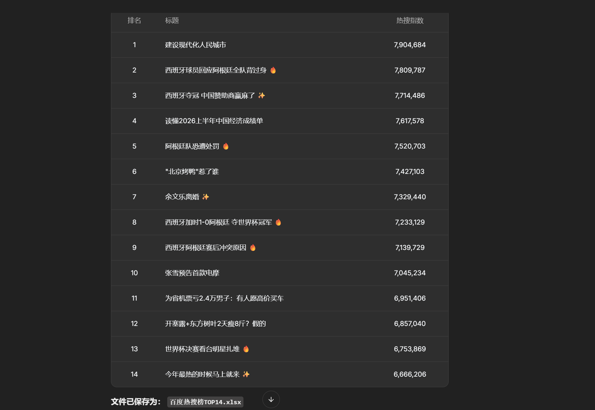
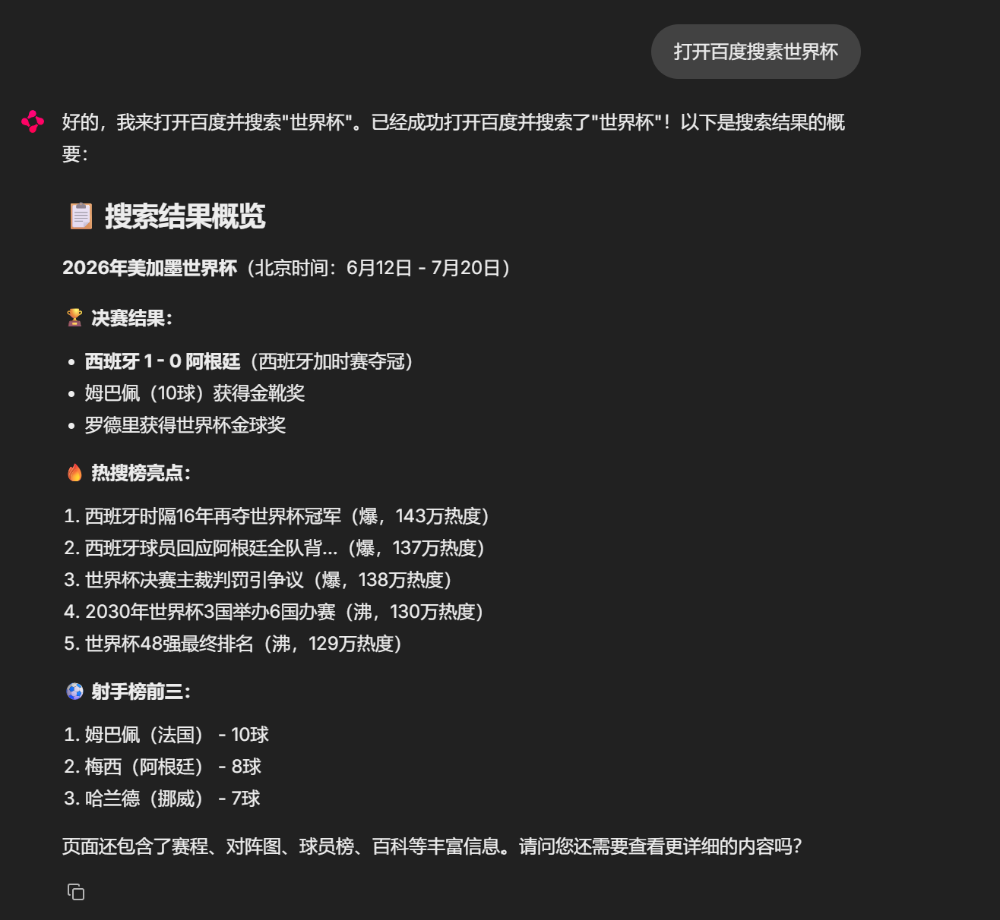

# 🖥️ Office Agent — AI 办公自动化助手

基于 LangChain + LangGraph 的智能办公自动化 Agent，可操控浏览器完成网页任务，支持多轮对话上下文记忆，并能将结果导出为 Excel。

## ✨ 功能特性

- **🧠 AI 驱动**：基于 LLM（支持 OpenAI / DeepSeek / Ollama 本地模型），自动理解任务并规划执行步骤
- **🌐 浏览器操控**：通过 Playwright 操控 Chromium / Edge / Chrome，支持导航、点击、输入、截图、文本提取等
- **💬 多轮对话**：集成 LangGraph MemorySaver，Agent 可记住上下文，支持连续交互
- **📊 Excel 导出**：内置 `write_excel` 工具，可将抓取的数据直接输出为带格式的 Excel 文件
- **🛡️ 安全约束**：不会擅自提交表单、下单购物或删除数据
- **🔄 自动恢复**：浏览器意外关闭后自动重建，保证会话不中断

## 🛠️ 可用工具

### 浏览器工具（10 个）
| 工具 | 功能 |
|------|------|
| `navigate` | 导航到指定 URL |
| `click` | 点击页面元素（CSS 选择器） |
| `type_text` | 在输入框中输入文字 |
| `screenshot` | 截取当前页面截图 |
| `extract_text` | 提取指定元素文本 |
| `extract_all_text` | 提取页面全部可见文字（≤8000 字符） |
| `scroll_down` | 向下滚动一屏 |
| `press_key` | 模拟按键（Enter / Tab / Esc 等） |
| `get_current_url` | 获取当前页面 URL |
| `wait` | 等待指定秒数 |

### 辅助工具（2 个）
| 工具 | 功能 |
|------|------|
| `get_current_time` | 获取当前日期时间 |
| `write_excel` | 将数据写入带格式的 .xlsx 文件 |

## 🏗️ 技术栈

| 组件 | 技术 |
|------|------|
| Agent 框架 | LangChain 1.x + LangGraph |
| 浏览器自动化 | Playwright |
| Web UI | Chainlit |
| LLM 支持 | OpenAI / DeepSeek / Ollama |
| 数据导出 | openpyxl |
| 配置管理 | Pydantic Settings |

## 📁 项目结构

```
office-agent/
├── agent/
│   ├── tools/
│   │   ├── browser.py      # 浏览器操控工具（10个）
│   │   └── utils.py        # 辅助工具（时间、Excel）
│   ├── core.py             # Agent 核心引擎 + 会话管理
│   └── prompts.py          # 系统提示词
├── ui/
│   └── app.py              # Chainlit 聊天界面
├── .chainlit/
│   └── config.toml         # Chainlit 配置
├── config.py               # 全局配置（Pydantic Settings）
├── requirements.txt        # 依赖清单
├── .env.example            # 环境变量模板
└── test_agent.py           # 测试脚本
```

## 🚀 快速开始

### 1. 环境准备

```bash
# 克隆仓库
git clone <https://github.com/chengxin2245/office-agent.git>
cd office-agent

# 安装依赖
pip install -r requirements.txt

# 安装 Playwright 浏览器（Chromium）
playwright install chromium
```

### 2. 配置 LLM

复制 `.env.example` 为 `.env`，选择一种 LLM 方式：

```env
# 推荐：DeepSeek API（便宜、中文好）
OPENAI_API_KEY=sk-your-deepseek-key
OPENAI_BASE_URL=https://api.deepseek.com/v1
MODEL_NAME=deepseek-chat
LLM_PROVIDER=openai

# 浏览器渠道：msedge（Edge）/ chrome / 留空（默认Chromium）
BROWSER_CHANNEL=msedge
BROWSER_HEADLESS=false
```

> 也支持 Ollama 本地模型，详见 `.env.example` 中的注释说明。

### 3. 启动

```bash
# Windows PowerShell
$env:PYTHONPATH = "."
chainlit run ui/app.py --port 8000

# macOS / Linux
PYTHONPATH=. chainlit run ui/app.py --port 8000
```

浏览器访问 `http://localhost:8000` 即可开始使用。

## 📝 使用示例

### 网页信息采集
> "打开百度热搜榜，提取前10条热搜内容"

### 数据导出
> "爬取百度热搜榜 TOP14，并生成一份 Excel 文件"

### 表单填写
> "打开百度网站，在搜索框输入'世界杯'，点击搜索按钮"

### 连续对话
> 1. "打开百度" → Agent 导航到百度
> 2. "搜索 Python 教程" → Agent 记得当前在百度，直接填入搜索
> 3. "打开第一个搜索结果" → Agent 记住搜索了什么

## ⚙️ 配置参考

| 环境变量 | 说明 | 默认值 |
|----------|------|--------|
| `LLM_PROVIDER` | LLM 提供商：`openai` / `ollama` | `openai` |
| `OPENAI_API_KEY` | API 密钥 | - |
| `OPENAI_BASE_URL` | API 地址 | `https://api.openai.com/v1` |
| `MODEL_NAME` | 模型名称 | `gpt-4o` |
| `OLLAMA_BASE_URL` | Ollama 地址 | `http://localhost:11434` |
| `OLLAMA_MODEL` | Ollama 模型 | `qwen2.5:7b` |
| `BROWSER_HEADLESS` | 无头模式 | `false` |
| `BROWSER_CHANNEL` | 浏览器渠道 | 空（默认 Chromium） |

## 🧪 运行测试

```bash
python test_agent.py
```

## 📄 License

MIT
